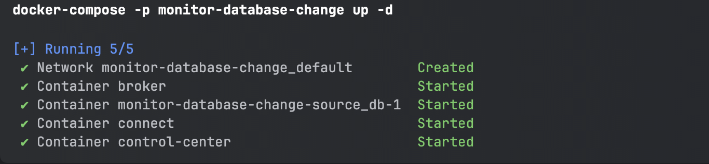
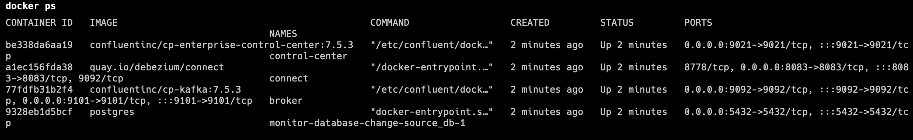
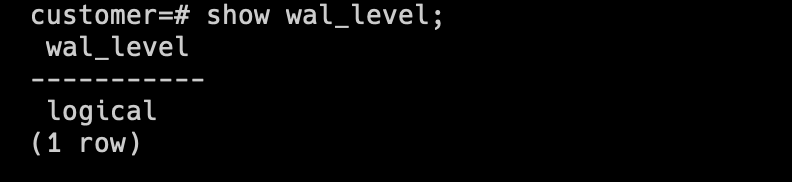
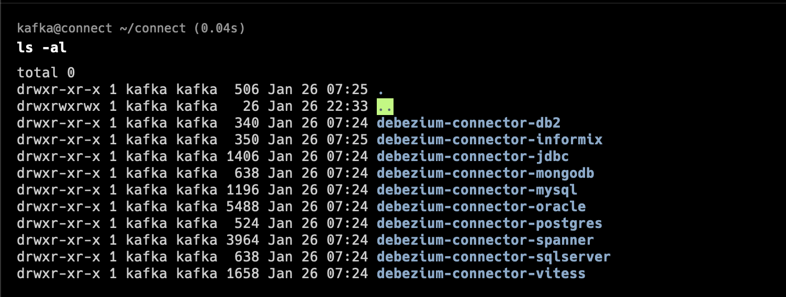
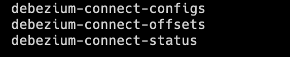
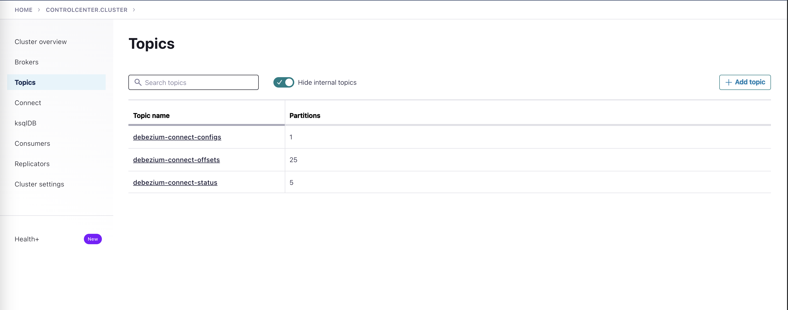
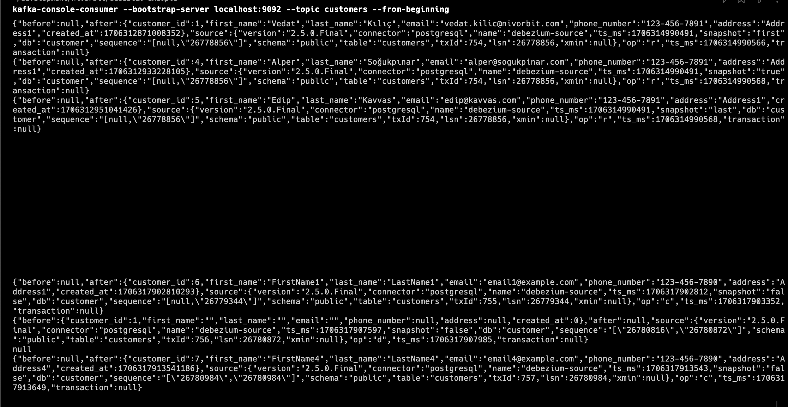

# Data Replica With Sink Connector

Demonstrates how to use Debezium to monitor a Postgres database

You will start the Debezium services, run two Postgres database servers with a simple basic dataset, and use Debezium to monitor the database for changes, and write data to another database using kafka-connect sink connectors.

## Prerequisites

You should install latest version of [Docker](https://docs.docker.com/engine/install/)

## Introduction to Debezium

Please refer to [Monitor Database Change](../monitor-database-change/README.md)

## Starting services

- Start the stack with the -d option to run in detached mode:
```shell
docker-compose up -d
```

Your output should resemble:



- Verify that the services are up and running:
```shell
docker ps
```
or
```shell
docker-compose ps
```

Your output should resemble:



After a few minutes, if the state of any component isn’t Up, run the docker-compose up -d command again, or try docker-compose restart <image-name>, for example:

```shell
docker-compose restart control-center
```

For more information, see the Docker documentation.

To see the container output, you would need to use the below command:
```shell
docker logs --follow <container-name>
```

- Navigate to Control Center at http://localhost:9021. It may take a minute or two for Control Center to start and load.
- Connect to database container shell and make sure wal_level is logical

To use Debezium for change data capture (CDC) effectively, the PostgreSQL database's wal_level configuration must be set to "logical," enabling the Write-Ahead Logging mechanism to capture detailed, transaction-level changes required by Debezium's logical decoding process.


```shell
docker exec -it source_db bash
psql -d user -U postgres
show wal_level;
```

Your output should resemble:



If the PostgreSQL database's wal_level is not set to "logical," you must update the PostgreSQL configuration:

```sql
ALTER SYSTEM SET wal_level = 'logical';
```

- Connect to kafka-connect container and check connector
```shell
docker exec -it connect bash
cd connect
ls -al
```

Your output should resemble:



- Install kafka-cli to connect kafka or use control center to check topics:

```shell
brew install kafka
kafka-topics --bootstrap-server localhost:9092 --list
```

Your output should resemble:



or using Control Center, Navigate to http://localhost:9021 and go to topics:



**If you haven't encountered any errors up to this point, we can proceed to the next step.**

## Debezium Connect

### Set up connector

If you have previously started Kafka Connect and verified that it is up and running, we can proceed to the next step. Kafka Connect exposes an API on port 8083 for managing connectors. Using this API, we will configure the PostgreSQL connector.

- Check the status of the Kafka Connect service

```shell
curl -H "Accept:application/json" localhost:8083/

{
  "version": "3.6.1",
  "commit": "5e3c2b738d253ff5",
  "kafka_cluster_id": "MkU3OEVBNTcwNTJENDM2Qg"
}
```
- Check the list of connectors registered with Kafka Connect

```shell
curl -H "Accept:application/json" localhost:8083/connectors/
[]
```
**No connectors are currently registered with Kafka Connect**

#### Deploy PostgreSQL Connector

For more information, see [Debezium Connector For PostgreSQL](https://debezium.io/documentation/reference/2.5/connectors/postgresql.html#debezium-connector-for-postgresql)

- Review the configuration of the Debezium PostgreSQL connector that you will register.

```json
{
  "name": "source-user-connector",
  "config": {
    "connector.class": "io.debezium.connector.postgresql.PostgresConnector",
    "tasks.max": "1",
    "database.hostname": "source_db",
    "database.port": "5432",
    "database.user": "postgres",
    "database.password": "postgres",
    "database.dbname": "user",
    "table.include.list": "source.customers",
    "heartbeat.interval.ms": "1000",
    "key.converter.schemas.enable": "false",
    "key.converter": "org.apache.kafka.connect.json.JsonConverter",
    "value.converter.schemas.enable": "false",
    "value.converter": "org.apache.kafka.connect.json.JsonConverter",
    "plugin.name": "pgoutput",
    "topic.prefix": "debezium-source",
    "snapshot.mode": "always",
    "transforms": "route",
    "transforms.route.type": "org.apache.kafka.connect.transforms.RegexRouter",
    "transforms.route.regex": "([^.]+)\\.([^.]+)\\.([^.]+)",
    "transforms.route.replacement": "$3"
  }
}
```

For more information, see [PostgreSQL connector configuration properties](https://debezium.io/documentation/reference/2.5/connectors/postgresql.html#postgresql-example-configuration).

- Register connector

```shell
POST http://localhost:8083/connectors
Content-Type: application/json

{
  "name": "source-user-connector",
  "config": {
    "connector.class": "io.debezium.connector.postgresql.PostgresConnector",
    "tasks.max": "1",
    "database.hostname": "source_db",
    "database.port": "5432",
    "database.user": "postgres",
    "database.password": "postgres",
    "database.dbname": "user",
    "table.include.list": "source.customers",
    "heartbeat.interval.ms": "1000",
    "key.converter.schemas.enable": "false",
    "key.converter": "org.apache.kafka.connect.json.JsonConverter",
    "value.converter.schemas.enable": "false",
    "value.converter": "org.apache.kafka.connect.json.JsonConverter",
    "plugin.name": "pgoutput",
    "topic.prefix": "debezium-source",
    "snapshot.mode": "always",
    "transforms": "route",
    "transforms.route.type": "org.apache.kafka.connect.transforms.RegexRouter",
    "transforms.route.regex": "([^.]+)\\.([^.]+)\\.([^.]+)",
    "transforms.route.replacement": "$3"
  }
}
```

- Verify that source-user-connector is included in the list of connectors:

```shell
curl -H "Accept:application/json" localhost:8083/connectors/
["source-user-connector"]
```

- Review the connector’s tasks:
```shell
curl -i -X GET -H "Accept:application/json" localhost:8083/connectors/source-user-connector
{
  "name": "source-user-connector",
  "config": {
    "connector.class": "io.debezium.connector.postgresql.PostgresConnector",
    "database.user": "postgres",
    "database.dbname": "user",
    "tasks.max": "1",
    "transforms": "route",
    "heartbeat.interval.ms": "1000",
    "database.port": "5432",
    "plugin.name": "pgoutput",
    "key.converter.schemas.enable": "false",
    "transforms.route.type": "org.apache.kafka.connect.transforms.RegexRouter",
    "topic.prefix": "debezium-source",
    "transforms.route.regex": "([^.]+)\\.([^.]+)\\.([^.]+)",
    "database.hostname": "source_db",
    "database.password": "postgres",
    "value.converter.schemas.enable": "false",
    "name": "source-user-connector",
    "table.include.list": "source.customers",
    "value.converter": "org.apache.kafka.connect.json.JsonConverter",
    "transforms.route.replacement": "$3",
    "key.converter": "org.apache.kafka.connect.json.JsonConverter",
    "snapshot.mode": "always"
  },
  "tasks": [
    {
      "connector": "source-user-connector",
      "task": 0
    }
  ],
  "type": "source"
}
```

- Watching the connector start

When you register a connector, it generates a large amount of log output in the Kafka Connect container.

```text
2024-01-27 00:23:10,487 INFO   Postgres|debezium-source|snapshot  Taking a new snapshot as per configuration   [io.debezium.connector.postgresql.snapshot.AlwaysSnapshotter]
2024-01-27 00:23:10,487 INFO   Postgres|debezium-source|snapshot  According to the connector configuration data will be snapshotted   [io.debezium.connector.postgresql.PostgresSnapshotChangeEventSource]
2024-01-27 00:23:10,488 INFO   Postgres|debezium-source|snapshot  Snapshot step 1 - Preparing   [io.debezium.relational.RelationalSnapshotChangeEventSource]
2024-01-27 00:23:10,489 INFO   Postgres|debezium-source|snapshot  Setting isolation level   [io.debezium.connector.postgresql.PostgresSnapshotChangeEventSource]
2024-01-27 00:23:10,489 INFO   Postgres|debezium-source|snapshot  Opening transaction with statement SET TRANSACTION ISOLATION LEVEL REPEATABLE READ; 
SET TRANSACTION SNAPSHOT '00000007-00000003-1';   [io.debezium.connector.postgresql.PostgresSnapshotChangeEventSource]
2024-01-27 00:23:10,527 INFO   Postgres|debezium-source|snapshot  Snapshot step 2 - Determining captured tables   [io.debezium.relational.RelationalSnapshotChangeEventSource]
2024-01-27 00:23:10,528 INFO   Postgres|debezium-source|snapshot  Adding table public.customers to the list of capture schema tables   [io.debezium.relational.RelationalSnapshotChangeEventSource]
2024-01-27 00:23:10,529 INFO   Postgres|debezium-source|snapshot  Created connection pool with 1 threads   [io.debezium.relational.RelationalSnapshotChangeEventSource]
2024-01-27 00:23:10,529 INFO   Postgres|debezium-source|snapshot  Snapshot step 3 - Locking captured tables [public.customers]   [io.debezium.relational.RelationalSnapshotChangeEventSource]
2024-01-27 00:23:10,529 INFO   Postgres|debezium-source|snapshot  Snapshot step 4 - Determining snapshot offset   [io.debezium.relational.RelationalSnapshotChangeEventSource]
2024-01-27 00:23:10,530 INFO   Postgres|debezium-source|snapshot  Creating initial offset context   [io.debezium.connector.postgresql.PostgresOffsetContext]
2024-01-27 00:23:10,531 INFO   Postgres|debezium-source|snapshot  Read xlogStart at 'LSN{0/1989D20}' from transaction '754'   [io.debezium.connector.postgresql.PostgresOffsetContext]
2024-01-27 00:23:10,533 INFO   Postgres|debezium-source|snapshot  Read xlogStart at 'LSN{0/1989CE8}' from transaction '754'   [io.debezium.connector.postgresql.PostgresSnapshotChangeEventSource]
2024-01-27 00:23:10,533 INFO   Postgres|debezium-source|snapshot  Snapshot step 5 - Reading structure of captured tables   [io.debezium.relational.RelationalSnapshotChangeEventSource]
2024-01-27 00:23:10,533 INFO   Postgres|debezium-source|snapshot  Reading structure of schema 'public' of catalog 'user'   [io.debezium.connector.postgresql.PostgresSnapshotChangeEventSource]
2024-01-27 00:23:10,551 INFO   Postgres|debezium-source|snapshot  Snapshot step 6 - Persisting schema history   [io.debezium.relational.RelationalSnapshotChangeEventSource]
2024-01-27 00:23:10,551 INFO   Postgres|debezium-source|snapshot  Snapshot step 7 - Snapshotting data   [io.debezium.relational.RelationalSnapshotChangeEventSource]
2024-01-27 00:23:10,551 INFO   Postgres|debezium-source|snapshot  Creating snapshot worker pool with 1 worker thread(s)   [io.debezium.relational.RelationalSnapshotChangeEventSource]
2024-01-27 00:23:10,557 INFO   Postgres|debezium-source|snapshot  For table 'public.customers' using select statement: 'SELECT "customer_id", "first_name", "last_name", "email", "phone_number", "address", "created_at" FROM "public"."customers"'   [io.debezium.relational.RelationalSnapshotChangeEventSource]
2024-01-27 00:23:10,560 INFO   Postgres|debezium-source|snapshot  Exporting data from table 'public.customers' (1 of 1 tables)   [io.debezium.relational.RelationalSnapshotChangeEventSource]
2024-01-27 00:23:10,568 INFO   Postgres|debezium-source|snapshot  	 Finished exporting 3 records for table 'public.customers' (1 of 1 tables); total duration '00:00:00.008'   [io.debezium.relational.RelationalSnapshotChangeEventSource]
2024-01-27 00:23:10,570 INFO   Postgres|debezium-source|snapshot  Snapshot - Final stage   [io.debezium.pipeline.source.AbstractSnapshotChangeEventSource]
2024-01-27 00:23:10,570 INFO   Postgres|debezium-source|snapshot  Snapshot completed   [io.debezium.pipeline.source.AbstractSnapshotChangeEventSource]
2024-01-27 00:23:10,579 INFO   Postgres|debezium-source|snapshot  Snapshot ended with SnapshotResult [status=COMPLETED, offset=PostgresOffsetContext [sourceInfoSchema=Schema{io.debezium.connector.postgresql.Source:STRUCT}, sourceInfo=source_info[server='debezium-source'db='user', lsn=LSN{0/1989CE8}, txId=754, timestamp=2024-01-27T00:23:10.491516Z, snapshot=FALSE, schema=public, table=customers], lastSnapshotRecord=true, lastCompletelyProcessedLsn=null, lastCommitLsn=null, streamingStoppingLsn=null, transactionContext=TransactionContext [currentTransactionId=null, perTableEventCount={}, totalEventCount=0], incrementalSnapshotContext=IncrementalSnapshotContext [windowOpened=false, chunkEndPosition=null, dataCollectionsToSnapshot=[], lastEventKeySent=null, maximumKey=null]]]   [io.debezium.pipeline.ChangeEventSourceCoordinator]
```

In the log output above, the first few lines involve the task activity of the connector, and report some bookkeeping information (in this case, that the connector was started with no prior offset). The next three lines involve the snapshot activity of the connector, and report that a snapshot is being started using the debezium Postgres user along with the Postgres grants associated with that user.

**The snapshot process will take longer with your databases, but the connector outputs enough log messages that you can track what it is working on, even when the tables have a large number of rows. And although an exclusive write lock is used at the beginning of the snapshot process, it should not last very long even for large databases. This is because the lock is released before any data is copied.**

#### Viewing change events

After deploying the Debezium connector, it starts monitoring the database for data change events.
When you watched the connector start up, you saw that events were written to the following topic **"user"**

```shell
kafka-topics --bootstrap-server localhost:9092 --list

customers
debezium-connect-configs
debezium-connect-offsets
debezium-connect-status
```

```shell
kafka-console-consumer --bootstrap-server localhost:9092 --topic customers --from-beginning

{"before":null,"after":{"customer_id":1,"first_name":"Vedat","last_name":"Kılıç","email":"vedat.kilic@nivorbit.com","phone_number":"123-456-7891","address":"Address1","created_at":1706312871008352},"source":{"version":"2.5.0.Final","connector":"postgresql","name":"debezium-source","ts_ms":1706314990491,"snapshot":"first","db":"user","sequence":"[null,\"26778856\"]","schema":"public","table":"customers","txId":754,"lsn":26778856,"xmin":null},"op":"r","ts_ms":1706314990566,"transaction":null}
{"before":null,"after":{"customer_id":4,"first_name":"Alper","last_name":"Soğukpınar","email":"alper@sogukpinar.com","phone_number":"123-456-7891","address":"Address1","created_at":1706312933228105},"source":{"version":"2.5.0.Final","connector":"postgresql","name":"debezium-source","ts_ms":1706314990491,"snapshot":"true","db":"user","sequence":"[null,\"26778856\"]","schema":"public","table":"customers","txId":754,"lsn":26778856,"xmin":null},"op":"r","ts_ms":1706314990568,"transaction":null}
{"before":null,"after":{"customer_id":5,"first_name":"Edip","last_name":"Kavvas","email":"edip@kavvas.com","phone_number":"123-456-7891","address":"Address1","created_at":1706312951041426},"source":{"version":"2.5.0.Final","connector":"postgresql","name":"debezium-source","ts_ms":1706314990491,"snapshot":"last","db":"user","sequence":"[null,\"26778856\"]","schema":"public","table":"customers","txId":754,"lsn":26778856,"xmin":null},"op":"r","ts_ms":1706314990568,"transaction":null}  
```

**After configuring the Debezium connector, as seen, it executed a snapshot capturing the initial data and wrote it to the Kafka topic.**

**After these steps, you will observe that create, update, and delete operations on the database are being written to the Kafka topic. Since the Kafka connector is configured to listen only to the existing table, operations on the 'customers' table will be written to the Kafka topic named 'customers.' If you want to perform load testing, running the 'generate_data.sh' script will create a file named 'data.sql.' Executing this SQL file will result in a total of 50,000 transactions, comprising a mix of inserts, updates, and deletes.**



If you want to capture 'before' information, the default replication identity for tables won't be sufficient. To include this information, table-specific replication identity should be configured.

```sql
ALTER TABLE customers REPLICA IDENTITY FULL;
```