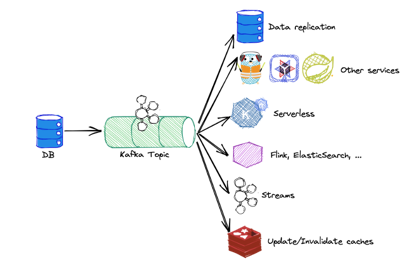
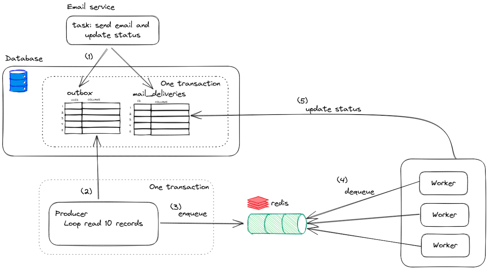
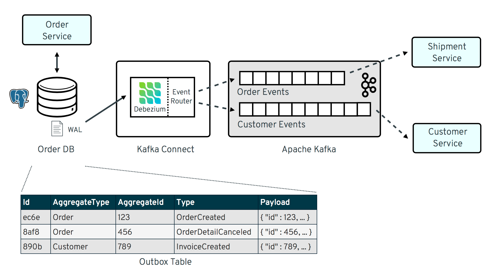
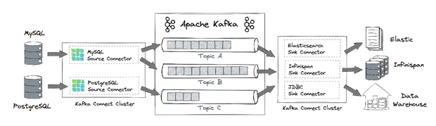
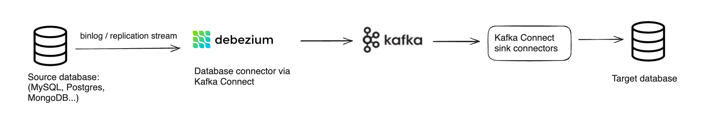
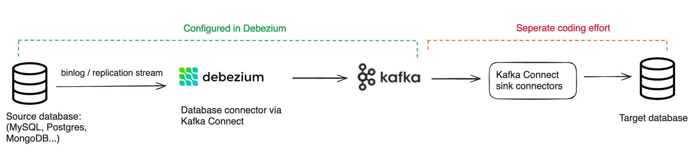
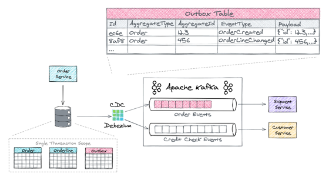
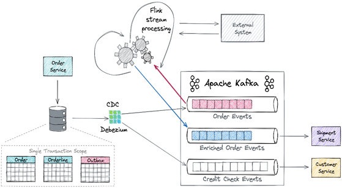
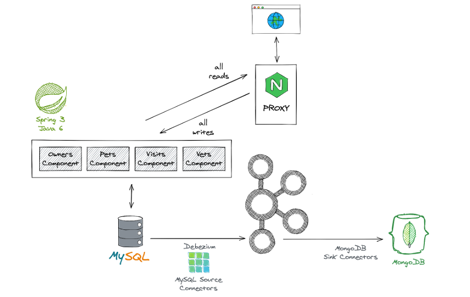
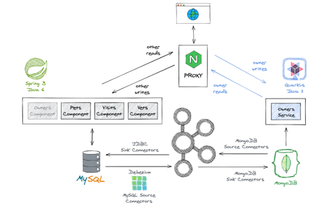

# Change Data Capture with Debezium

## Change Data Capture (CDC)

Capturing data changes refers to the process of recording and documenting alterations or modifications in a dataset over time. This practice is crucial for various fields, including database management, software development, and data analytics. By tracking data changes, organizations can maintain a historical record of alterations, allowing them to analyze trends, troubleshoot issues, and ensure data integrity. This process often involves implementing version control systems, audit trails, or change logs to systematically document and manage any modifications made to the dataset, fostering transparency and accountability in data management practices.



## Architectural Patterns or Commonly Used Solutions

### Outbox Pattern

The Outbox Pattern involves placing messages in an "outbox" as part of the same database transaction that modifies the data. These messages represent the changes made to the data and are subsequently consumed by a separate process responsible for propagating these changes to downstream systems or consumers. This pattern ensures that changes and messages are committed atomically.



#### Pros of the Outbox Pattern
- **Reliable Event Delivery:** By ensuring that events are written to an outbox within the same database transaction as the corresponding data changes, you achieve atomicity—either both the data and the event are persisted, or neither.
- **Consistent State**
- **Decoupling Components**

#### Cons of the Outbox Pattern
- **Database Coupling**
- **Complexity in Implementation**
- **Potential for Message Duplication**
- **Scalability Concerns**

### Transaction Log (Log-Based CDC)

Log-Based CDC involves reading the transaction logs of a database to capture changes. This method is particularly powerful because it allows you to track all changes at a low level, including inserts, updates, and deletes. Log-based CDC is often used in conjunction with tools and technologies that can efficiently read and interpret transaction logs, extracting change information for further processing.
 
- In PostgreSQL, the transaction logs are collectively known as Write-Ahead Logging (WAL). The WAL files are stored in a designated directory specified in the PostgreSQL configuration. By default, this directory is named "pg_wal."
- In MongoDB, the transaction logs are known as the Oplog (short for operations log).



Both the Outbox Pattern and Log-Based CDC are widely used in distributed systems and event-driven architectures. They provide reliable ways to capture and propagate changes in a scalable and efficient manner. The choice between them often depends on factors like the existing infrastructure, database capabilities, and the overall architectural design of the system.

#### Pros of Transaction Log
- **Durability**
- **Replication and High Availability**
- **Performance Optimization:** Database systems can use the transaction log to optimize performance by allowing transactions to be written to the log before the corresponding changes are made to the actual data pages. This approach, known as write-ahead logging (WAL), can enhance the efficiency of write operations.

#### Cons of Transaction Log
- **Storage Overhead:** Transaction logs can consume a significant amount of storage space, especially in systems with high transaction volumes. Regular backups and log truncation are necessary to manage this storage overhead.
- **Little difficult to avoid duplicate publishing**

## Debezium
Debezium is an open-source distributed platform for change data capture (CDC). It is designed to capture changes made to data in a variety of database systems and make those changes available in real-time to other systems, particularly to Apache Kafka. Debezium acts as a set of connectors that can monitor the database's transaction log and produce a stream of change events.
- Taps into Database TX log to capture INSERT/UPDATE/DELETE events
- Propagated to consumers using Kafka and Kafka Connect
- A CDC Platform based on:
  - transaction logs 
  - Snapshotting, filtering, etc.
  - Outbox support
  - Web-based UI
- Fully open-source, very active community
- Large production deployments



### Why Companies Choose Debezium for CDC and Database Replication

Debezium’s flexibility, lightweight architecture, and low latency streaming make it a popular choice for CDC. It is also fairly easy to integrate into modern data stacks. Key benefits include:

- **Support for a wide range of databases:** Debezium has connectors for MongoDB, MySQL, PostgreSQL, SQL Server, Oracle, Db2, and Cassandra, with additional sources currently incubating.
- **Open source:** Debezium is open source under the Apache 2.0 license and backed by a strong community.
- **Low latency:** The architecture is lightweight and specifically designed for streaming data pipelines.
- **Pluggable:** Debezium works with popular infrastructure tools such as Kafka and Docker.
- **Handling schema changes:** Depending on the specific database connector, Debezium will typically provide some level of automation for handling schema changes. Note this is only on the source level and is not propagated downstream (as we explain below).

### How Debezium Works for Database Replication

A typical Debezium-based pipeline would look like this:



There are nuances to how Debezium reads from each database, but the basic premise is similar. Debezium connects to source databases and captures row-level changes, typically in real time or near-real time. The database connector translates the change events into change data capture records with details like the table, changed columns, type of operation etc.

CDC records are then streamed into a Kafka broker. By default, this would be one table per topic, although this is customizable. Downstream applications can consume these Kafka topics to power reporting, analytics, data pipelines, and more. Debezium also offers mechanisms to manage schema and ensure at-least once (but not exactly-once) processing.

The most common way to run Debezium is using the Apache Kafka Connect runtime and framework. It’s also possible to run it as a server that streams changes directly into message brokers such as Amazon Kinesis or Google Pub/Sub; however, this requires running the embedded engine writing additional code to handle outputting, Including keeping track of offsets and what has been handled already.

### Where it gets tricky

As with any software, there are trade-offs to using Debezium. Here are some of the potential complications you need to be aware of:

#### Ingesting the output stream into your target database (or data lake) is on you

Businesses usually want to replicate their operational databases in order to make them available for analytics – which means writing them into a database such as Snowflake or Redshift, or into a data lakehouse (S3 with Hive / Iceberg). However, Debezium’s role ends once the events are streaming to Kafka. From there, it’s up to developers and data engineers to ensure that the data arrives on the other side in the right format, on time, and that it accurately reflects the source data.



This is a non-trivial effort which involves managing and mapping tables in the target data store, validating data, managing schema per table, and handling incremental updates. In addition, ingesting any type of Kafka data at scale (e.g. to Snowflake) poses its own challenges. Open source Debezium doesn’t help with this, which means the full solution could incur significant additional overhead.

#### Kafka is a requirement

Debezium relies heavily on Kafka to deliver the change data captured from source databases. For companies that aren’t already using Kafka, this can be a major downside; managing a Kafka cluster requires continuous monitoring and tuning for factors like data retention policies, topic partitioning, and replication.

As data volume grows, Kafka capacity and throughput need to be managed actively to avoid degradation. Kubernetes and containers add further complexity when orchestrating Kafka in production. Operational tasks like upgrades, security patching, and failure recovery require significant engineering expertise.


### Outbox Pattern with Debezium

- An "outbox" table is created within the same database as the application's primary data. This table is used to temporarily store events or messages that need to be communicated to other parts of the system.

```sql
CREATE TABLE outbox (
  id SERIAL PRIMARY KEY,
  payload JSONB NOT NULL,
  processed BOOLEAN DEFAULT FALSE
);
```

- Debezium is then configured to capture changes from the outbox table. Debezium monitors the database's transaction log and captures inserts into the outbox table as change events. These events are transformed into a stream of messages that can be sent to a message broker, such as Apache Kafka.
- Debezium sends the captured change events, including the events from the outbox table, to Kafka topics. This allows other components or microservices within the system to subscribe to these topics and react to the changes.




### Strangler Fig Pattern with Debezium

The Strangler Fig Pattern is a software design pattern that is used in the context of evolving or refactoring existing systems. The pattern is named after the strangler fig tree, which is a type of plant that starts its life by growing on another tree and eventually envelops and "strangles" the host tree as it matures. Similarly, the Strangler Fig Pattern is a gradual migration strategy for replacing an old system with a new one.





