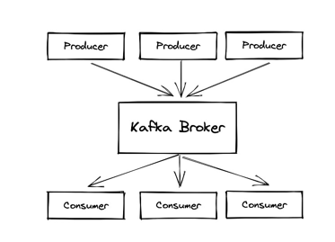
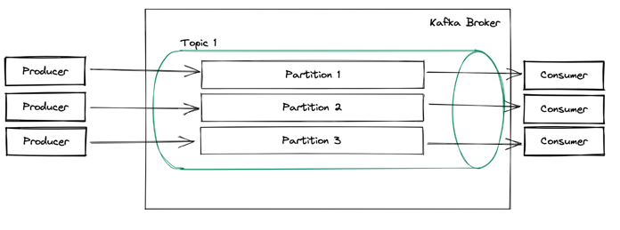

# Kafka
## What’s Kafka?

- Publish/Subscribe System
- Fault Tolerance/Scalability
  by construction
- Processing Streams in real time 

## Anatomy of a Partition

## Topics

# Kafka Connect

Kafka Connect is a tool for scalably and reliably streaming data between Apache Kafka® and other data systems. It makes it simple to quickly define connectors that move large data sets in and out of Kafka. Kafka Connect can ingest entire databases or collect metrics from all your application servers into Kafka topics, making the data available for stream processing with low latency. An export connector can deliver data from Kafka topics into secondary indexes like Elasticsearch, or into batch systems–such as Hadoop for offline analysis.

## What is Kafka Connect

Kafka Connect is a free, open-source component of Apache Kafka® that serves as a centralized data hub for simple data integration between databases, key-value stores, search indexes, and file systems. You can use Kafka Connect to stream data between Apache Kafka® and other data systems and quickly create connectors that move large data sets in and out of Kafka.

## Benefits of Kafka Connect

Kafka Connect provides the following benefits:

- Data-centric pipeline: Connect uses meaningful data abstractions to pull or push data to Kafka.
- Flexibility and scalability: Connect runs with streaming and batch-oriented systems on a single node (standalone) or scaled to an organization-wide service (distributed).
- Reusability and extensibility: Connect leverages existing connectors or extends them to fit your needs and provides lower time to production.
